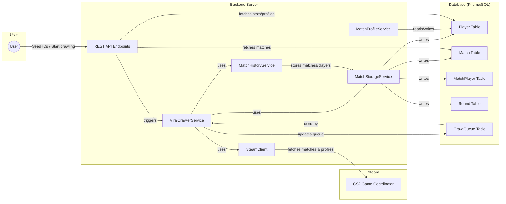

# SpyGlass

```mermaid
graph LR
  subgraph User
    U1((User))
  end

  subgraph Steam
    STEAM[CS2 Game Coordinator]
  end

  subgraph Backend["Backend Server"]
    API[REST API Endpoints]
    SteamClient["SteamClient"]
    Crawler["ViralCrawlerService"]
    MHService["MatchHistoryService"]
    MPService["MatchProfileService"]
    MStorage["MatchStorageService"]
  end

  subgraph DB["Database (Prisma/SQL)"]
    PlayerTable["Player Table"]
    MatchTable["Match Table"]
    MatchPlayerTable["MatchPlayer Table"]
    RoundTable["Round Table"]
    CrawlQueue["CrawlQueue Table"]
  end

  U1 -- Seed IDs / Start crawling --> API
  API -- triggers --> Crawler
  Crawler -- uses --> SteamClient
  SteamClient -- fetches matches & profiles --> STEAM

  Crawler -- uses --> MHService
  Crawler -- uses --> MStorage
  Crawler -- updates queue --> CrawlQueue

  MHService -- stores matches/players --> MStorage
  MStorage -- writes --> PlayerTable
  MStorage -- writes --> MatchTable
  MStorage -- writes --> MatchPlayerTable
  MStorage -- writes --> RoundTable

  CrawlQueue -- used by --> Crawler

  MPService -- reads/writes --> PlayerTable
  API -- fetches stats/profiles --> PlayerTable
  API -- fetches matches --> MatchTable
```
