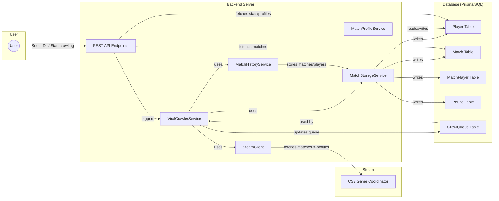
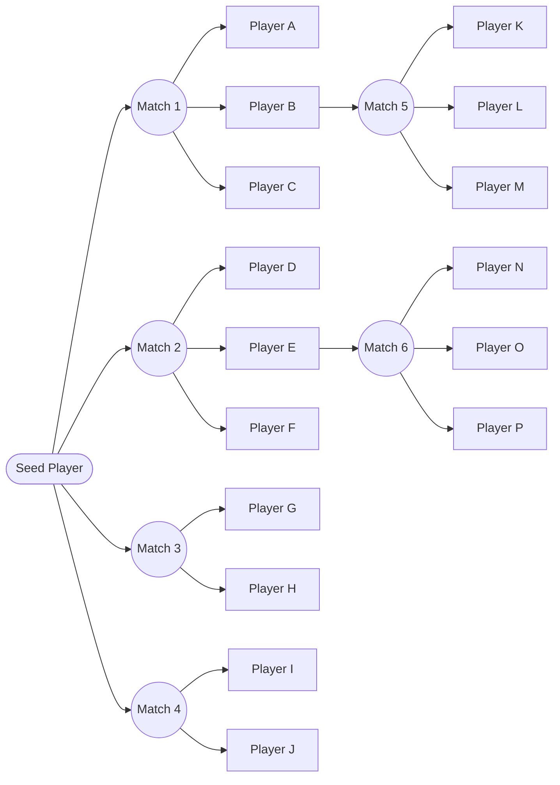
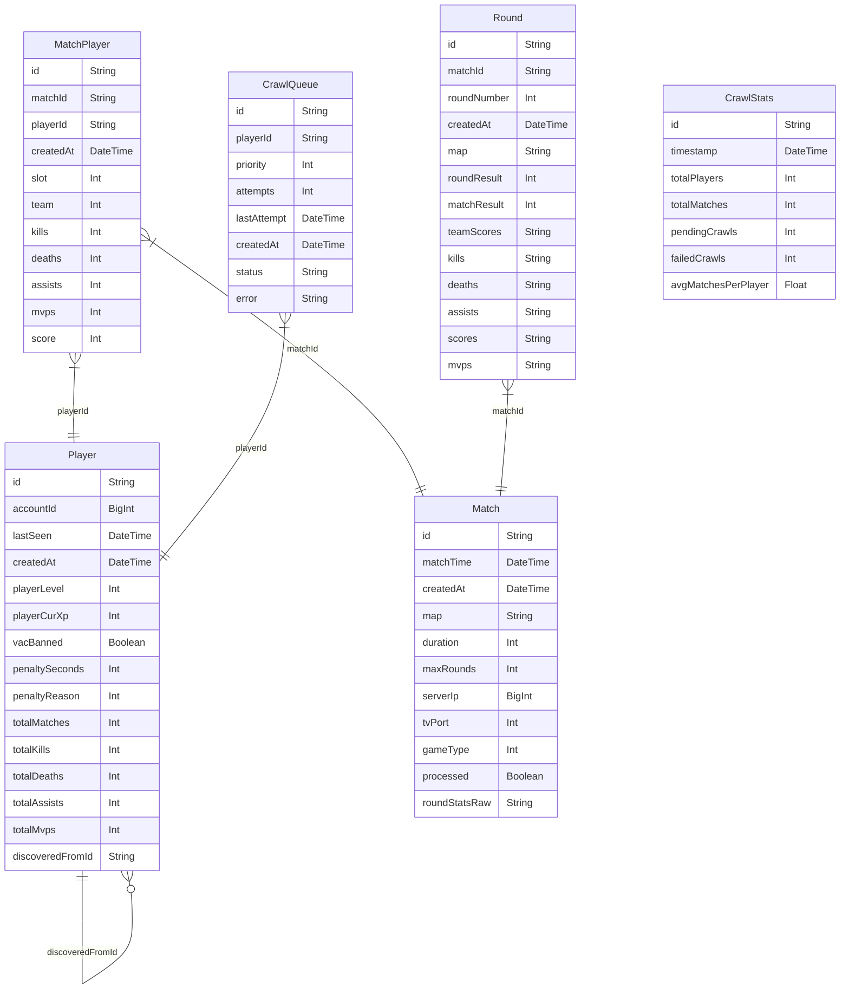

# SpyGlass

## Problem: The Limitation of Valve

Valve's CS2 Game Coordinator only allows you to retrieve the **last 8 matches** for any given player.

This means:

- You cannot access the full match historyfor a player over time
- Valuable stats, relationships, and in-depth analytics are lost once a player plays more games
- Longitudinal or viral player/match linkage (player graph, social links, full stat aggregation) is impossible with just direct GC queries

## Solution: The Virus

**SpyGlass's viral crawler** solves this by:

- Starting from 1 or more seeded Steam IDs
- Grabbing each seed's last 8 matches via GC
- Discover all players from those matches
- **Persist all matches, players, rounds, and relationships** in a scalable database
- Repeat the above steps recursively such that it:
- Builds a living, growing network of historical CS2 match data that bypasses Valve's 8 match window

## System Design

## Virus Network

### Entity Relationship Diagram

---

## FAQ

**Q: Is this compliant with what GC allows?**

A: The crawler never fetches more than 8 matches per player, but by connecting the dots across all visible players, it indirectly reconstructs deep match/player histories.

**Q: Can I get an entire region’s matches and player stats?**

A: Yes. The more seed IDs and the longer you let it run, the larger your web of tracked matches and players will be.

**Q: Are there any limitations?**

A: Yes. For players that have private profiles or are not opted-in to match tracking, the GC will not publish their data.

---

**No more losing data after 8 games.**
**With SpyGlass, you build an ever-growing, living network of match stats—across all of CS2.**
